# Migration Utility — Functional Specification

**Product:** Arthavi Migration Utility  
**Version:** 0.8.0  
**Status:** Production (Vercel) + local/Docker dev  
**Last updated:** June 2026  
**Live:** https://migration-utility.vercel.app  
**Repository:** https://github.com/dashsanat2024-sys/migration-utility  

**Related documents**

| Document | Purpose |
|----------|---------|
| **[FUNCTIONAL_SPECIFICATION.docx](./FUNCTIONAL_SPECIFICATION.docx)** | **Word version** (diagrams as ASCII — opens in Microsoft Word) |
| [PROJECT_DOCUMENTATION.md](./PROJECT_DOCUMENTATION.md) | Technical setup, API index, deployment |
| [PLUGIN_SCHEMA_DESIGN.md](./PLUGIN_SCHEMA_DESIGN.md) | Destination-as-plugin design rationale |
| [kraken-schema-reference.md](../kraken-schema-reference.md) | Kraken ST Water AccountType fields |

---

## 1. Purpose and scope

### 1.1 Purpose

Migration Utility is a **generic, industry-aware data migration platform** that lets migration teams configure, validate, transform, and load structured records from a **legacy source** into a **modern destination system**, with full auditability and reconciliation.

The platform supports the complete migration lifecycle:

**Extract → Validate → Transform → Load → Reconcile**

Configuration is stored in PostgreSQL and driven through a React web UI. The v0.8 flagship flow is **destination-first schema mapping**: the destination publishes its field contract via a **destination plugin**, and source extracts map into that contract.

### 1.2 In scope (v0.8)

| Area | Capability |
|------|------------|
| Project management | Create projects by migration type, industry, integration approach |
| Destination plugins | Kraken Account (ST Water), SAP CRM, file export, mock |
| Schema & mapping | Upload source extract/catalog, auto-suggest mappings, apply to rule sets |
| Ingest & staging | CSV/JSON/XML upload, per-project staging tables, error queue |
| Rules & transforms | Validation rules, field mappings, transform types, workflow states |
| Tariff mapping | Utilities product/rate band → destination codes (industry-gated) |
| Candidate selection | Filter staged records before run |
| Migration runs | Pipeline execution with batches, audit log, load records |
| Reconciliation | Funnel, variance, sample diffs, BI JSON export |
| Deployment | Vercel (UI + serverless API) + Neon PostgreSQL |

### 1.3 Out of scope (v0.8)

| Item | Status |
|------|--------|
| User authentication / RBAC login | Planned |
| Live Kraken GraphQL schema introspection | Planned |
| Document migration, DB migration types | Scaffolded (disabled in UI) |
| Banking / healthcare industry templates | Scaffolded (coming soon) |
| Multi-tenant SaaS billing | Not planned in v0.8 |

---

## 2. Actors and stakeholders

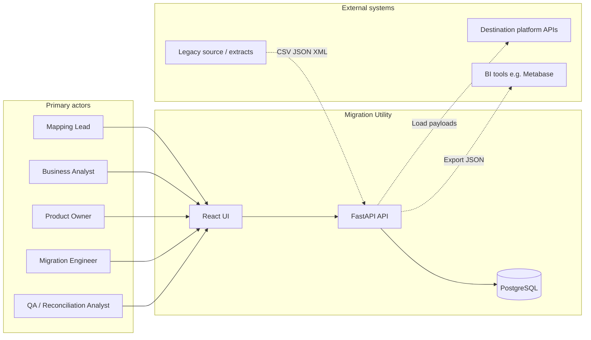

| Actor | Role | Typical tasks |
|-------|------|----------------|
| **Mapping Lead** | Owns field mapping | Upload extracts, map fields, submit for review |
| **Business Analyst** | Validates business rules | Review mappings, approve rule sets |
| **Product Owner** | Sign-off authority | Final sign-off before production runs |
| **Migration Engineer** | Executes runs | Stage data, configure selection, run pipeline |
| **QA / Reconciliation** | Post-run verification | Reconciliation funnel, variance, BI export |

> **Note:** Workflow roles exist in the backend (`mapping_lead`, `business_analyst`, `product_owner`) but **login/RBAC is not yet implemented** — roles are passed via API request body in dev.

---

## 3. System context (C4 — Level 1)

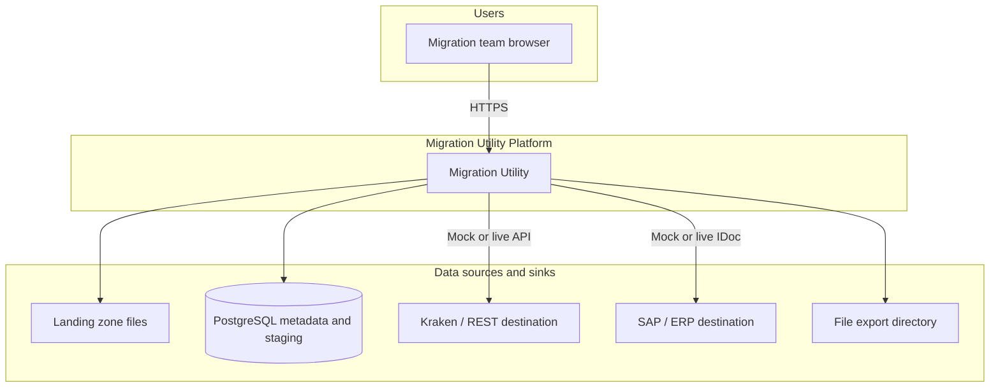

**System boundary:** Migration Utility owns configuration, orchestration, staging, validation, transformation, load tracking, and reconciliation. It does **not** own the legacy source system or the destination platform of record.

---

## 4. Container architecture (C4 — Level 2)

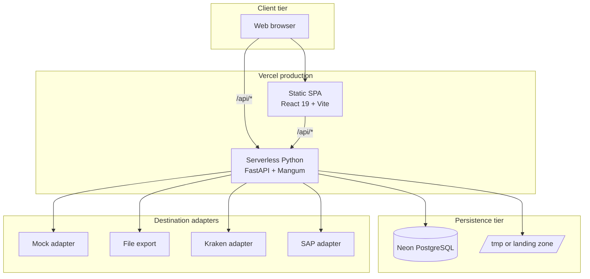

### 4.1 Container descriptions

| Container | Technology | Responsibility |
|-----------|------------|----------------|
| **React SPA** | Vite 6, React 19, React Router 7 | Dashboard, project workspace, mapping canvas, run monitoring |
| **FastAPI API** | Python 3.11+, Mangum on Vercel | REST API, pipeline orchestration, plugin registry |
| **PostgreSQL** | Neon (prod), Docker (local) | Projects, rules, catalogs, runs, staging tables, audit |
| **Landing zone** | Filesystem / `/tmp` | Uploaded extract files before parse |
| **Target adapters** | Python connectors | Mock, file export, Kraken, SAP load implementations |

### 4.2 Local / Docker deployment

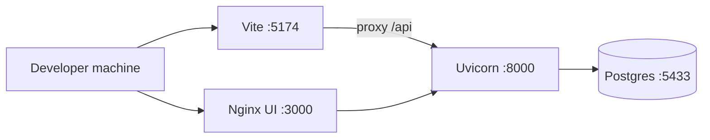

---

## 5. Application architecture (C4 — Level 3)

### 5.1 Backend component diagram

```mermaid
flowchart TB
  subgraph api [API layer — FastAPI routes]
    R_PROJ[projects]
    R_WS[workspace]
    R_DEST[destination]
    R_FIELDS[fields]
    R_INGEST[ingest]
    R_RULES[rules]
    R_MAP[mapping]
    R_TARIFF[tariffs]
    R_SEL[selection]
    R_RUNS[runs]
    R_RECON[reconciliation]
    R_HEALTH[health]
  end

  subgraph domain [Domain services]
    FCAT[FieldCatalogService]
    RSVC[RuleSetService]
    MSVC[MappingService]
    TSVC[TariffService]
    SSVC[SelectionService]
    ISVC[IngestService]
    RECON[ReconciliationService]
    RUNNER[RunService]
  end

  subgraph engines [Engines]
    VAL[ValidationEngine]
    XFORM[TransformEngine]
    WF[WorkflowEngine]
    PIPE[MigrationPipeline]
    SEL_ENG[SelectionEngine]
  end

  subgraph plugins [Plugin and connector registries]
    PLUG[DestinationPluginRegistry]
    CONN[ConnectorRegistry]
    SCHEMA[SchemaRegistry]
    TARGET[TargetRegistry]
  end

  subgraph datastore [Data access]
    ORM[SQLAlchemy ORM]
    STAGING[Dynamic staging tables]
  end

  R_PROJ --> ORM
  R_WS --> FCAT
  R_WS --> PLUG
  R_WS --> ORM
  R_DEST --> PLUG
  R_FIELDS --> FCAT
  R_INGEST --> ISVC
  R_RULES --> RSVC
  R_RULES --> VAL
  R_RULES --> XFORM
  R_MAP --> MSVC
  R_MAP --> WF
  R_TARIFF --> TSVC
  R_SEL --> SSVC
  R_SEL --> SEL_ENG
  R_RUNS --> RUNNER
  R_RUNS --> PIPE
  R_RECON --> RECON
  PIPE --> CONN
  PIPE --> VAL
  PIPE --> XFORM
  ISVC --> STAGING
  FCAT --> ORM
  RSVC --> ORM
  RUNNER --> ORM
```

### 5.2 Frontend component diagram

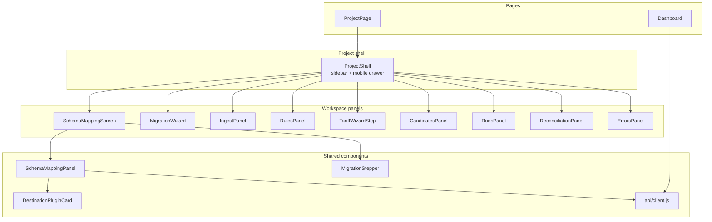

### 5.3 URL and navigation model

| Route | Screen | Notes |
|-------|--------|-------|
| `/` | Dashboard | Project list, create project wizard |
| `/projects/{slug}` | Project workspace | Tab state in React (not in URL) |

Default tab: **Schema & Mapping**. Mobile: hamburger drawer + sticky top bar.

---

## 6. Core functional domains

### 6.1 Project setup

**Description:** User creates a migration project with a profile that drives visible features and defaults.

**Setup wizard steps**

1. Migration type (Data / Document / DB — only Data enabled)
2. Industry (Utilities, Generic, Banking/Healthcare — scaffolded)
3. Integration approach (API, File — Database/Hybrid scaffolded)
4. Project details (name, slug, environment, connectors)

**Profile stored in** `project.config.profile`:

```json
{
  "migration_type": "data_migration",
  "industry": "utility",
  "integration_approach": "api",
  "features": {
    "tariff_mapping": true,
    "validation_rules": true,
    "transform_rules": true
  }
}
```

**Functional requirements**

| ID | Requirement | Priority |
|----|-------------|----------|
| PRJ-01 | System shall create a project with unique slug | Must |
| PRJ-02 | System shall resolve project by UUID or slug in API | Must |
| PRJ-03 | Profile shall gate tariff tab for non-utility industries | Must |
| PRJ-04 | System shall persist source/target connector keys on project | Must |

---

### 6.2 Destination plugin system

**Description:** Each destination is a plugin that publishes a typed schema contract via `get_schema(entity)`.

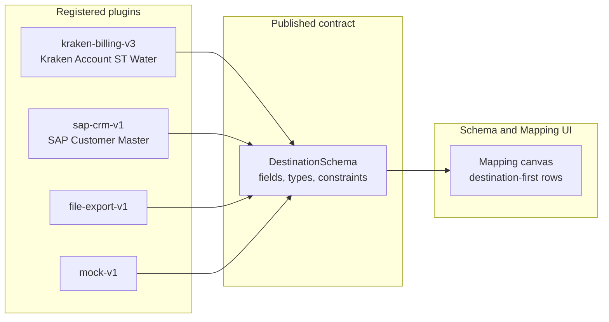

| Plugin ID | Label | Adapter key | Transport |
|-----------|-------|-------------|-----------|
| `kraken-billing-v3` | Kraken Account — Severn Trent Water | `kraken` | GraphQL · REST |
| `sap-crm-v1` | SAP Customer Master | `sap` | IDoc / BAPI |
| `file-export-v1` | JSON File Export | `file_export` | File system |
| `mock-v1` | Mock Destination | `mock` | In-memory |

**Functional requirements**

| ID | Requirement | Priority |
|----|-------------|----------|
| PLG-01 | System shall list available destination plugins | Must |
| PLG-02 | System shall return active plugin schema for a project | Must |
| PLG-03 | User shall swap destination plugin with orphan confirmation | Must |
| PLG-04 | User may upload custom destination schema CSV/JSON | Should |
| PLG-05 | Kraken plugin shall expose ST Water AccountType fields (~40+) | Must |

**Key API**

| Method | Endpoint |
|--------|----------|
| GET | `/api/destination/plugins` |
| GET | `/api/projects/{id}/destination/plugin` |
| GET | `/api/projects/{id}/destination/schema?entity=account` |
| POST | `/api/projects/{id}/destination/swap` |

---

### 6.3 Schema and field mapping

**Description:** Destination-first mapping canvas. Each destination field is a "socket"; user assigns source columns and transform logic.

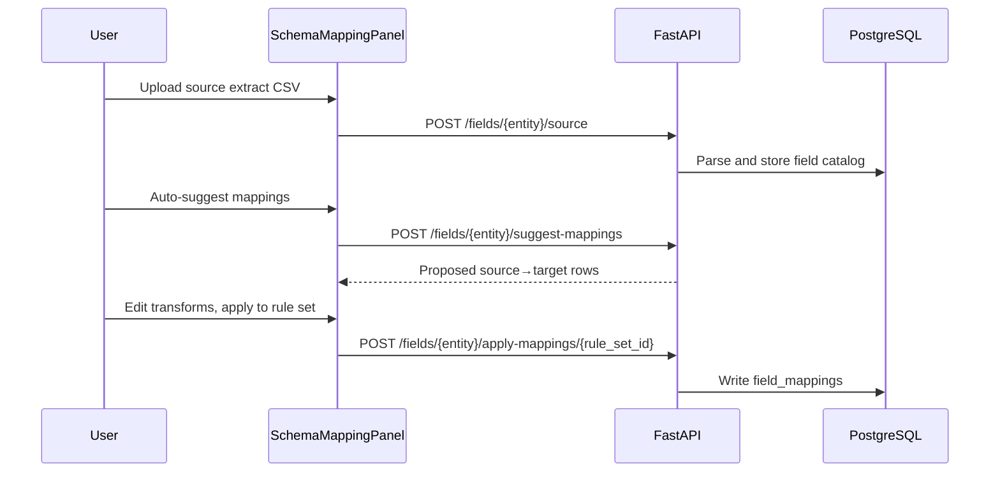

**Source upload formats**

| Format | Detection | Result |
|--------|-----------|--------|
| Field catalog CSV/JSON | Header row with `name`, `data_type` | Field definition rows |
| Data extract CSV/JSON | Multi-column, no catalog header | Column headers → source fields |

**Transform types**

| Type | Use case |
|------|----------|
| `copy` | Direct field copy |
| `constant` | Hardcoded value (e.g. `migrationSource`) |
| `default` | Fallback when empty |
| `lookup` | Enum translation (status, account type) |
| `concat` | Join name parts |
| `conditional` | Y/N flags → boolean |
| `uppercase` / `lowercase` | Normalization |
| `date_format` | Date reformatting |
| `pad_left` | Padded identifiers |
| `regex_replace` | Strip/normalize patterns |

**Functional requirements**

| ID | Requirement | Priority |
|----|-------------|----------|
| MAP-01 | System shall render one row per destination schema field | Must |
| MAP-02 | System shall auto-suggest mappings with alias matching | Must |
| MAP-03 | Unmapped source columns shall appear as source-only rows | Must |
| MAP-04 | Mappings shall apply to a selected rule set | Must |
| MAP-05 | Mapping edits locked when rule set not in draft/in_review | Must |
| MAP-06 | Filter chips: All, Unmapped, Required, Provenance, Transform | Should |

---

### 6.4 Ingest and staging

**Description:** Upload raw extract files; valid rows land in per-project PostgreSQL staging tables.

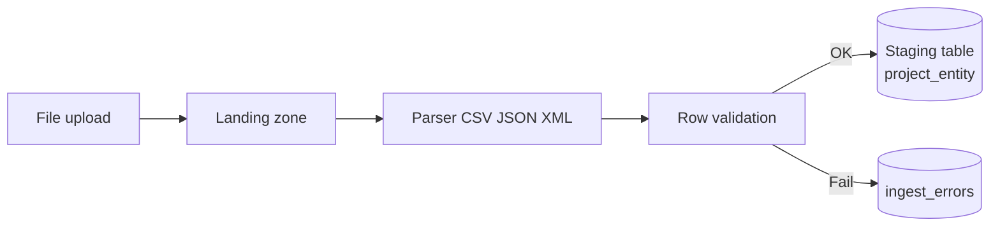

**Functional requirements**

| ID | Requirement | Priority |
|----|-------------|----------|
| ING-01 | Support CSV, JSON, XML ingest | Must |
| ING-02 | Persist ingest file metadata and row counts | Must |
| ING-03 | Record failed rows with reason in ingest_errors | Must |
| ING-04 | Expose staging stats per entity | Must |
| ING-05 | Allow reprocess of corrected error rows | Should |

---

### 6.5 Rules, validation, and workflow

**Description:** Rule sets version validation rules and field mappings. Workflow gates edits and run eligibility.

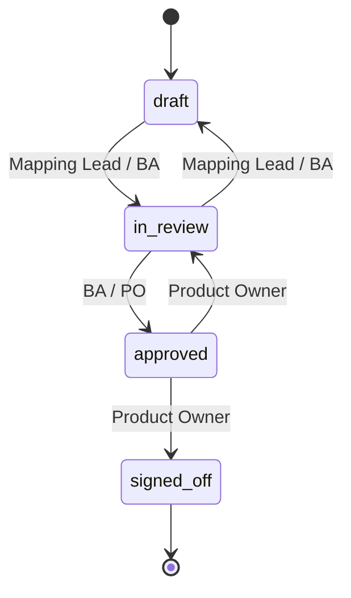

**Validation rule types:** `required`, `format`, `in_list`, `range`, `cross_field`, `unique`

**Functional requirements**

| ID | Requirement | Priority |
|----|-------------|----------|
| RUL-01 | CRUD rule sets per project and entity | Must |
| RUL-02 | Seed starter account rules | Must |
| RUL-03 | Validation engine runs during pipeline validate stage | Must |
| RUL-04 | Transform engine applies field mappings during transform stage | Must |
| RUL-05 | Workflow transitions recorded in mapping_approvals | Must |
| RUL-06 | Preview transform API for single-record dry run | Should |

---

### 6.6 Tariff mapping (utilities)

**Description:** Map legacy product/rate codes to destination tariff/product codes. Separate workflow from field mapping.

| ID | Requirement | Priority |
|----|-------------|----------|
| TAR-01 | CRUD tariff mapping sets | Must |
| TAR-02 | Seed sample tariff rows | Must |
| TAR-03 | Load signed-off tariffs to destination adapter | Should |
| TAR-04 | Tab hidden when `features.tariff_mapping = false` | Must |

---

### 6.7 Candidate selection

**Description:** Filter which staged records are included in a migration run.

**Criterion operators:** `eq`, `in`, `contains`, `range`, null checks; AND/OR logic; `max_candidates` limit.

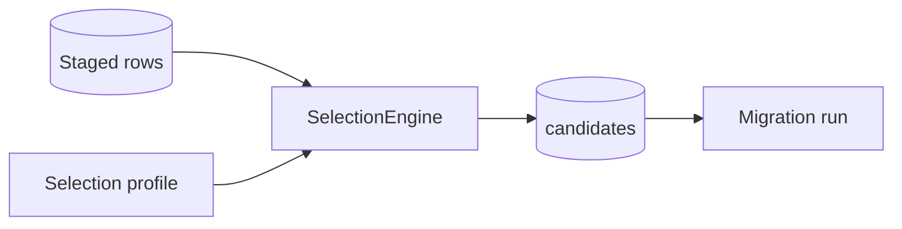

| ID | Requirement | Priority |
|----|-------------|----------|
| SEL-01 | CRUD selection profiles and criteria | Must |
| SEL-02 | Preview selection counts before run | Must |
| SEL-03 | Toggle criteria on/off without delete | Must |
| SEL-04 | Run config: use_selection, selection_profile_id | Must |

---

### 6.8 Migration pipeline (runs)

**Description:** Core ETL pipeline executed per migration run.

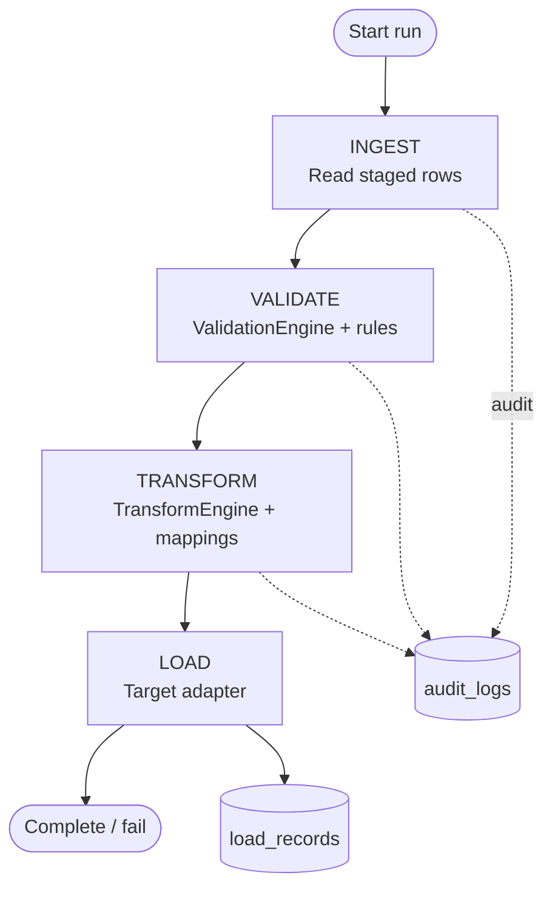

**Run configuration (examples)**

| Key | Description |
|-----|-------------|
| `use_rules` | Apply approved rule set |
| `rule_set_id` | Specific rule set UUID |
| `use_selection` | Filter by selection profile |
| `selection_profile_id` | Profile UUID |
| `candidate_limit` | Cap records per run |
| `require_approved_rules` | Block run if not approved |

**Source connectors:** `staging`, `mock`  
**Target adapters:** `mock`, `file_export`, `kraken`, `sap`

| ID | Requirement | Priority |
|----|-------------|----------|
| RUN-01 | Create run with one or more batches | Must |
| RUN-02 | Execute ingest → validate → transform → load | Must |
| RUN-03 | Persist per-stage audit log entries | Must |
| RUN-04 | Persist load request/response per record | Must |
| RUN-05 | Expose run status, batches, error message | Must |

---

### 6.9 Reconciliation

**Description:** Post-run counts, funnel, variance, and BI export.

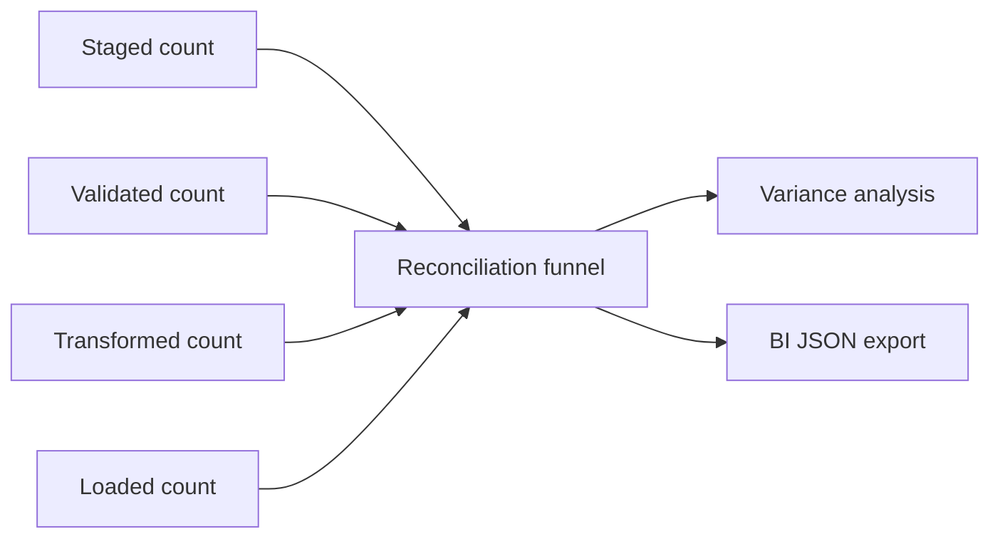

| ID | Requirement | Priority |
|----|-------------|----------|
| REC-01 | Project-level reconciliation summary | Must |
| REC-02 | Run-level funnel and variance | Must |
| REC-03 | Sample source vs target payload diff | Should |
| REC-04 | Download reconciliation export JSON | Must |

---

## 7. Data architecture

### 7.1 Entity relationship (logical)

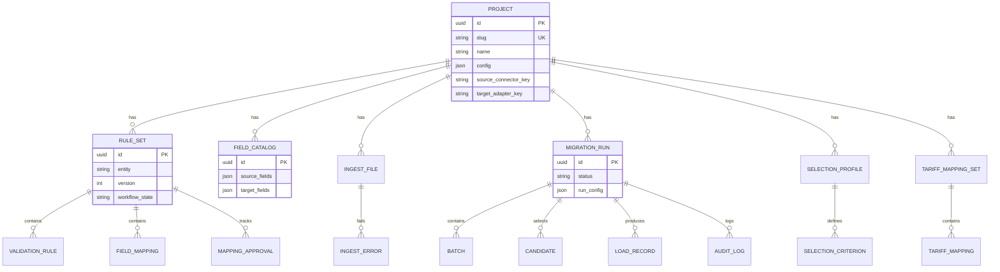

### 7.2 Database phases (Alembic)

| Phase | Key tables |
|-------|------------|
| 0 | `projects`, `migration_runs`, `batches`, `audit_logs` |
| 1 | `ingest_files`, `ingest_errors`, dynamic staging |
| 2 | `rule_sets`, `validation_rules`, `field_mappings` |
| 3 | `selection_profiles`, `selection_criteria`, `candidates` |
| 4 | `mapping_approvals`, `tariff_mapping_sets`, `tariff_mappings` |
| 5 | `load_records` |
| 6 | `field_catalogs` |

### 7.3 Workspace bootstrap (performance)

Single API call for project open:

```
GET /api/projects/{slug}/workspace?entity=account
```

Returns: `project`, `plugin`, `destination_schema`, `catalog`, `rule_sets`, `entities`

---

## 8. End-to-end user journey

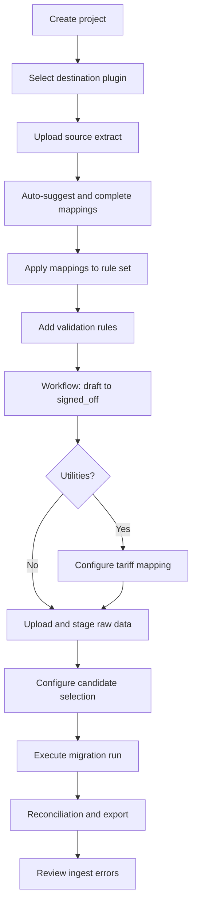

### 8.1 Recommended tab sequence

| Step | UI tab | Outcome |
|------|--------|---------|
| 1 | Schema & Mapping | Destination contract + field mappings |
| 2 | Upload & Stage | Raw data in staging tables |
| 3 | Transform Rules | Validation + workflow approval |
| 4 | Tariff Mapping | Product translations (utilities) |
| 5 | Candidate Selection | Record filter for run |
| 6 | Migration Runs | Execute pipeline |
| 7 | Reconciliation | Post-run verification |
| 8 | Ingest Errors | Fix and reprocess failures |

---

## 9. API summary

Base path: `/api` — OpenAPI at `/docs` (local).

| Domain | Prefix | Key operations |
|--------|--------|----------------|
| Health | `/health`, `/health/live` | Liveness and DB check |
| Projects | `/projects` | CRUD; slug or UUID lookup |
| Workspace | `/projects/{ref}/workspace` | Bootstrap payload |
| Destination | `/destination/plugins`, `/projects/{id}/destination/*` | Plugin schema and swap |
| Fields | `/projects/{id}/fields/{entity}/*` | Catalog upload, suggest, apply |
| Ingest | `/projects/{id}/ingest/*` | Upload, stats, errors |
| Rules | `/projects/{id}/rules/*` | Rule sets, validation, workflow |
| Mapping | `/projects/{id}/mapping/*` | Matrix, approvals |
| Tariffs | `/projects/{id}/tariffs/*` | Tariff sets, load |
| Selection | `/projects/{id}/selection/*` | Profiles, preview |
| Runs | `/projects/{id}/runs`, `/runs/{id}/*` | Execute, audit, loads |
| Reconciliation | `/projects/{id}/reconciliation/*` | Summary, export |

---

## 10. Non-functional requirements

| Category | Requirement | Current state |
|----------|-------------|---------------|
| **Availability** | Vercel auto-deploy from `main` | Implemented |
| **Performance** | Workspace bootstrap ≤ 1 round-trip on project open | Implemented v0.8 |
| **Performance** | Serverless cold start 3–5s first request | Known limitation |
| **Scalability** | Stateless API; DB connection per request on serverless | NullPool on Vercel |
| **Security** | Secrets in env vars only | Implemented |
| **Security** | Authentication / RBAC | **Implemented v0.9** (`AUTH_ENABLED`) |
| **Enterprise** | Async worker, progress, resume | **Implemented v0.9** |
| **Enterprise** | Data profiling + exception queue | **Implemented v0.9** |
| **Auditability** | All workflow transitions and run stages logged | Implemented |
| **Portability** | Docker Compose local stack | Implemented |
| **Mobile** | Responsive drawer navigation | Implemented v0.8 |
| **Testing** | 65 automated backend tests | pytest |

---

## 11. Environment configuration

| Variable | Purpose |
|----------|---------|
| `DATABASE_URL` | PostgreSQL connection (Neon in prod) |
| `LANDING_ZONE_PATH` | Upload storage (`/tmp` on Vercel) |
| `EXPORT_PATH` | File export adapter output |
| `CORS_ORIGINS` | Allowed frontend origins |
| `KRAKEN_MOCK_MODE` | Mock vs live Kraken load (default `true`) |
| `KRAKEN_API_URL` | Kraken API base |
| `SAP_MOCK_MODE` | Mock vs live SAP load |
| `SAP_API_URL` | SAP integration URL |
| `AUTH_ENABLED` | Enable JWT login and RBAC |
| `RUNNER_MODE` | `api` (sync) or `worker` (async queue) |
| `HTTP_PROXY` / `HTTPS_PROXY` | Corporate egress proxy |
| `CLIENT_CERT_PATH` | mTLS client certificate |

---

## 12. Primary use case — Utilities / Kraken (reference)

**Scenario:** Severn Trent Water legacy Target/CMP extract → Kraken AccountType.

| Legacy (source) | Kraken (destination) | Transform |
|-----------------|----------------------|-----------|
| `CUST_ACCOUNT_NO` | `number` | copy |
| `LEGACY_SYS_REF` | `urn` | copy |
| `CUST_TYPE_FLAG` | `accountType` | lookup D→DOMESTIC |
| `ACCT_STATUS_CODE` | `status` | lookup A→ACTIVE |
| `STEPPED_RATE_FLAG` | `isOnSteppedTariff` | conditional Y/N |
| *(constant)* | `migrationSource` | constant `TARGET_CMP` |

**QA sample:** `target_cmp_sample_extract.csv` (20 rows, 15 columns)

---

## 13. Roadmap (functional)

| Feature | Target |
|---------|--------|
| SSO / OIDC integration | v1.0 |
| Live destination schema introspection | v0.9+ |
| Document and DB migration types | v1.0 |
| Banking / healthcare industry packs | v1.0 |
| Scheduled / recurring migration runs | TBD |
| Row-level rollback and re-run waves | TBD |

---

## 14. Glossary

| Term | Definition |
|------|------------|
| **Source** | Legacy system providing extract data |
| **Destination** | Target platform; publishes schema via plugin |
| **Destination plugin** | Module owning `get_schema()` contract |
| **Schema socket** | One destination field row on mapping canvas |
| **Rule set** | Versioned validation rules + field mappings |
| **Staging table** | Per-project PostgreSQL table for extract rows |
| **Field catalog** | Uploaded source/target field metadata |
| **Migration provenance** | Fields like `migrationSource`, `urn`, `isMigrated` |
| **Load record** | Persisted adapter request/response for one entity |
| **Reconciliation** | Post-run funnel, variance, and BI export |

---

## 15. Customer FAQ / RFP

- **[CUSTOMER_FAQ_RFP.md](./CUSTOMER_FAQ_RFP.md)** — detailed procurement and security Q&A  
- **[CAPABILITY_MATRIX.md](./CAPABILITY_MATRIX.md)** — one-page honest capability matrix for sales  
- **[DEPLOYMENT_RUNNER.md](./DEPLOYMENT_RUNNER.md)** — on-prem worker, proxy, mTLS  

---

*For setup and deployment details see [PROJECT_DOCUMENTATION.md](./PROJECT_DOCUMENTATION.md).*
